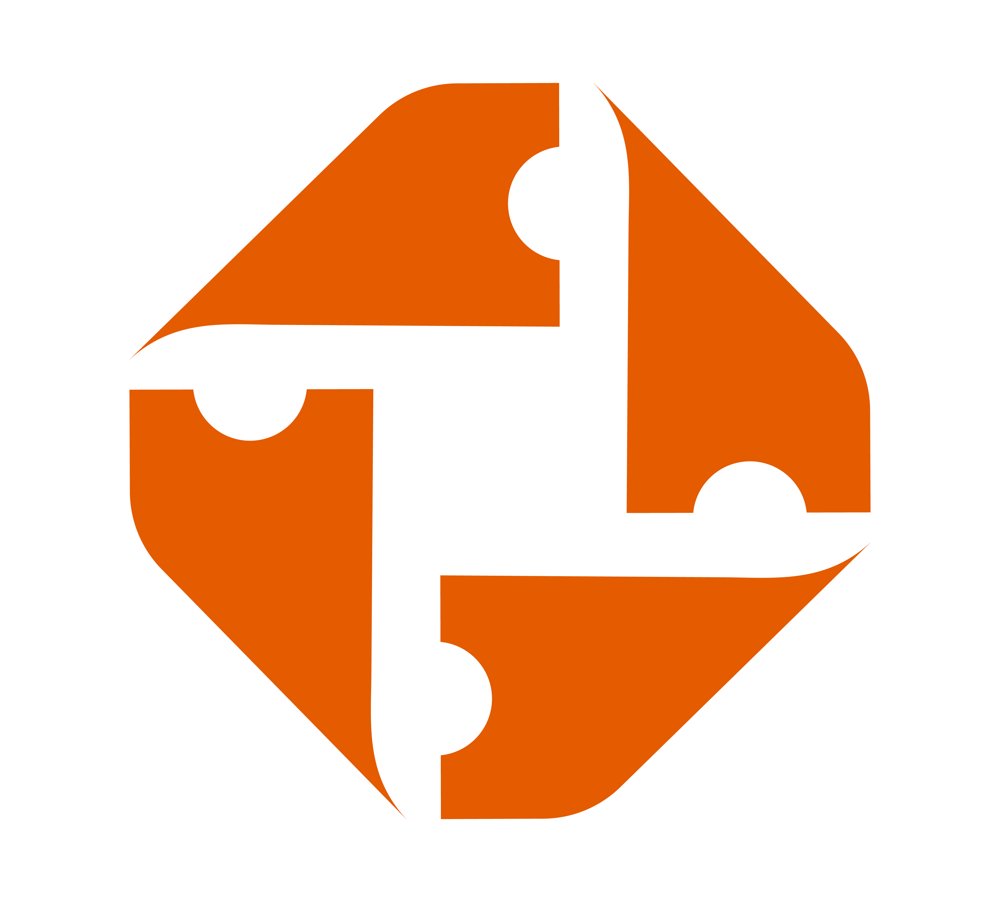

<div align="center">
  
  
  # Ticketwaze
  
  > Secure ticketing platforms across Your Country & beyond
</div>

Whether you're buying or selling, we make the ticketing process effortless. We make it easy to exchange tickets with trust, speed, and clarity, no matter where you are in the world.

## 📋 Table of Contents

- [About](#about)
- [Project Structure](#project-structure)
- [Tech Stack](#tech-stack)
- [Getting Started](#getting-started)
- [Development](#development)
- [Available Scripts](#available-scripts)
- [Working with Packages](#working-with-packages)
- [Contributing](#contributing)
- [Deployment](#deployment)

## 🎯 About

Ticketwaze is a comprehensive ticketing platform that provides secure and effortless ticket exchange services. The platform consists of two main applications:

- **Attende**: The ticket purchasing and management application for event attendees
- **Organizer**: The event creation and ticket management platform for event organizers

## 📁 Project Structure

This is a monorepo managed with pnpm workspaces:

```
ticketwaze/
├── apps/
│   ├── attende/          # Attendee-facing application
│   └── organizer/        # Organizer-facing application
├── packages/
│   └── ui/              # Shared UI component library (shadcn/ui)
├── package.json
├── pnpm-workspace.yaml
```

### Applications

#### Attende

The customer-facing application where users can:

- Browse and search for events
- Purchase tickets securely
- Manage their ticket inventory
<!-- - Transfer or resell tickets -->

#### Organizer

The event management platform where organizers can:

- Create and manage events
- Set up ticket types and pricing
- Monitor sales and analytics
<!-- - Manage attendee information -->

### Packages

#### UI Package

A shared component library built with shadcn/ui that provides:

- Consistent design system across applications
- Reusable React components
- Shared styling and theming
- Common UI patterns and utilities

## 🛠 Tech Stack

- **Framework**: Next.js 14 (App Router)
- **Language**: TypeScript
- **Package Manager**: pnpm
- **UI Library**: React
- **Component Library**: shadcn/ui
- **Styling**: Tailwind CSS
- **Monorepo Tool**: pnpm workspaces

## 🚀 Getting Started

### Prerequisites

- Node.js 18.x or higher
- pnpm 8.x or higher

### Installation

1. Clone the repository:

```bash
git clone https://github.com/TicketWaze/frontend.git
cd frontend
```

2. Install dependencies:

```bash
pnpm install
```

3. Set up environment variables:

```bash
# Refer to your team lead to get environnement variables
```

4. Start the development servers:

```bash
pnpm dev
```

This will start both applications:

- Attende: http://localhost:3001
- Organizer: http://localhost:3000

## 💻 Development

### Running Individual Apps

To run a specific application:

```bash
# Run attende app only
pnpm --filter attende dev

# Run organizer app only
pnpm --filter organizer dev
```

### Working with the UI Package

The `ui` package is automatically linked to both applications. Any changes made to components in the `ui` package will be reflected in both apps with hot module replacement.

To develop UI components:

```bash
# Navigate to the ui package
cd packages/ui

# Make your changes
# Components are automatically available in both apps
```

### Code Style and Linting

```bash
# Run linting across all packages
pnpm lint

# Fix linting issues
pnpm lint:fix

# Format code
pnpm format
```

### Type Checking

```bash
# Type check all packages
pnpm type-check
```

## 📜 Available Scripts

### Root Level Scripts

- `pnpm dev` - Start all applications in development mode
- `pnpm build` - Build all applications for production
- `pnpm start` - Start all applications in production mode
- `pnpm lint` - Lint all packages
- `pnpm test` - Run tests across all packages
- `pnpm clean` - Clean all node_modules and build artifacts

### App-Specific Scripts

Run scripts in a specific app using the `--filter` flag:

```bash
pnpm --filter attende <script>
pnpm --filter organizer <script>
pnpm --filter ui <script>
```

Available scripts per app:

- `dev` - Start development server
- `build` - Build for production
- `start` - Start production server
- `lint` - Run ESLint
- `test` - Run tests

## 📦 Working with Packages

### Adding Dependencies

```bash
# Add dependency to specific app
pnpm --filter attende add <package-name>
pnpm --filter organizer add <package-name>

# Add dependency to ui package
pnpm --filter ui add <package-name>

# Add dev dependency to root
pnpm add -D <package-name> -w
```

### Using Shared UI Components

Import components from the `ui` package in your apps:

```tsx
import { Button, Card, Dialog } from "@ticketwaze/ui";

export default function MyComponent() {
  return (
    <Card>
      <Button>Click me</Button>
    </Card>
  );
}
```

### Creating New Shared Components

1. Add new components to `packages/ui/src/components`
2. Export them from `packages/ui/src/index.ts`
3. Use them in any app by importing from `@ticketwaze/ui`

## 🤝 Contributing

We welcome contributions to Ticketwaze! Please follow these guidelines:

### Branch Naming Convention

- `feature/` - New features
- `fix/` - Bug fixes
- `docs/` - Documentation updates
- `refactor/` - Code refactoring
- `test/` - Test additions or modifications

Example: `feature/add-payment-integration`

### Commit Message Convention

Follow conventional commits:

```
type(scope): subject

body (optional)

footer (optional)
```

Types:

- `feat`: New feature
- `fix`: Bug fix
- `docs`: Documentation changes
- `style`: Code style changes (formatting, etc.)
- `refactor`: Code refactoring
- `test`: Test updates
- `chore`: Build process or auxiliary tool changes

Example:

```
feat(attende): add ticket filtering by category

Added category filter component and integrated with ticket listing page
```

### Pull Request Process

1. Create a new branch from `main`
2. Make your changes
3. Ensure all tests pass: `pnpm test`
4. Ensure linting passes: `pnpm lint`
5. Update documentation if needed
6. Submit a pull request with a clear description
7. Wait for code review and address feedback

### Development Workflow

1. Pick an issue or create one describing what you want to work on
2. Create your feature branch
3. Commit your changes
4. Push to your branch
5. Open a pull request

## 🚢 Deployment

### Environment Variables

Ensure all required environment variables are set for each application:

**Attende App:**

- `NEXT_PUBLIC_API_URL`
- `DATABASE_URL`
- (Add other required variables)

**Organizer App:**

- `NEXT_PUBLIC_API_URL`
- `DATABASE_URL`
- (Add other required variables)

### Build for Production

```bash
# Build all apps
pnpm build

# Build specific app
pnpm --filter attende build
pnpm --filter organizer build
```

## 📄 License

## 👥 Team

[ezenardr](https://github.com/ezenardr)

## 📞 Support

For questions or support, please [open an issue](link-to-issues) or contact [ezenardr.dev@gmail.com](mailto:ezenardr.dev@gmail.com).

---

Built with ❤️ by the Ticketwaze team
